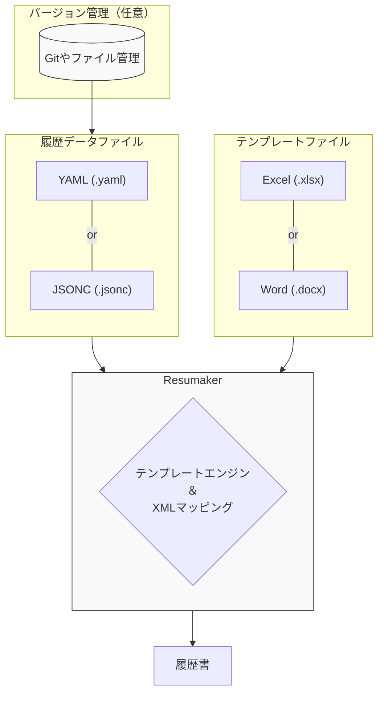

# Resumaker

Created and maintained by ayeci with Antigravity

**Resumaker** は、YAML/JSONC（コメント許容JSON）ファイル形式で記述された履歴書データをもとに、ExcelおよびWord形式の履歴書を生成するPWA（Progressive Web App）です。
データの管理をテキストベース（YAML or JSONC）で行うことで、バージョン管理や修正を容易にし、デザインされたテンプレートへの流し込みを自動化します。

## 🚀 使用方法

**アプリURL:** [https://ayeci.github.io/Resumaker/](https://ayeci.github.io/Resumaker/)

ブラウザから上記URLにアクセスするだけで、すぐにご利用いただけます。
また、PWA（Progressive Web App）に対応しているため、PCやスマートフォンのブラウザメニューから「ホーム画面に追加（アプリをインストール）」することで、ネイティブアプリのようにオフラインでもサクサク動作します。  
リポジトリからソースをダウンロードして、ローカル環境で実行することも可能です。（その場合は、`npm install` で必要なパッケージをインストールしてください。）



## ✨ 特徴

- **YAML/JSONC（コメント許容JSON）によるデータ管理**: 履歴書の情報を可読性の高いYAML形式、またはコメント付きJSON（JSONC）形式で記述します。
- **Excel / Word プレビュー機能**: 編集内容を確認しながら作業可能（ファイルアップロードでの読み込みにも対応）。  
  モバイル環境では最大5件まで、PCなら無制限にテンプレートを登録し、簡易的なプレビューが可能です。  
  （ただしライブラリの都合上、かなりレイアウトが崩れる場合があります。最終的にはエクスポートしたファイルで確認するのがベターです。）
- **Excelエクスポート**: 既存のExcelテンプレート（JIS規格等）のレイアウトやスタイル（結合セル、フォント、罫線など）を維持したままデータを出力します。
  - 学歴・職歴欄の統合処理（`history`）
  - 「現在に至る」「以上」などの自動追記、数式内の数値置換対応
- **Wordエクスポート**: Wordテンプレート（Docxtemplater）へのデータ流し込みに対応。
- **プライバシー重視**: クライアントサイド（ブラウザ）完結で動作するため、個人データが外部サーバーに送信されることはありません。
- **PWA対応**: インストール可能なProgressive Web Appとして動作し、オフラインでも利用可能です。
- **リアルタイムプレビュー**: 編集内容を確認しながら作業可能（ファイルアップロードでの読み込みにも対応）。
- **PDF保存・印刷**: ブラウザ標準の印刷機能を使用して、プレビュー通りの高品質なPDF保存や印刷が可能です。

## 🔒 セキュリティとプライバシー

Resumaker は「クライアントサイド完結型」のアプリケーションです。ユーザーのプライバシーを最優先に設計されています。

- **入力データはメモリ内のみ**: 入力された履歴書データはブラウザのメモリ上でのみ処理されます。  
  サーバーへの送信はもちろん、`localStorage` への保存も行いません。ブラウザを閉じるとデータは完全に破棄されます。
- **テンプレートファイルは揮発性暗号化で保護**: アップロードされたテンプレートファイルは、ブラウザのメモリ不足によるクラッシュを防ぐため、一時的にブラウザの内部ストレージ（`IndexedDB`）に保存されます。  
  しかし、完全なセキュリティを保証するため、**揮発性暗号化**メカニズムを採用しています：
  - アプリを開くたびに、メモリ（RAM）上に今回限りの使い捨て暗号化キー（AES-GCM 256bit）が生成されます。
  - テンプレートファイルは、ストレージに書き込まれる直前にこのキーで強力に暗号化されます。
  - **ブラウザのタブを閉じるかページを更新した瞬間、この暗号化キーは電子的に完全に消滅します。**
  - ストレージに残された暗号化データは数学的に復元不可能（ただの乱数のゴミ）となるため、共有端末であっても情報漏洩のリスクは一切ありません。  
    残存データは次回のアプリ起動時に自動的にクリーンアップされます。
- **トラッキングなし**: Cookie や Google Analytics 等の解析ツールは一切使用していません。
- **詳細**: [プライバシーポリシー](./PRIVACY.md) を参照してください。

## 📝 テンプレート作成ガイド

本アプリに含まれているテンプレートは、あくまで動作確認用の「最小限のサンプル」です。  
実用的な履歴書を作成する場合は、ご自身でテンプレートを用意することを強く推奨します。

> **Note:** 著作権の関係上、実用的なマーカー埋め込み済みのテンプレートは同梱していません。

- [厚生労働省の履歴書様式例](https://www.hellowork.mhlw.go.jp/member/career_doc01.html) などお好みのテンプレートをダウンロードしてください。
- ダウンロードしたファイルに、以下のガイドに従ってマーカー（例: `{name}`）を書き込むことで、あなた専用のテンプレートを作成できます。

### 1. 単一の値（Placeholders）

YAML/JSONデータのキーに対応する値を埋め込みます。(サンプル: `example/sample.xlsx`)  

**予約語以外でも、YAMLで定義した任意のキーを `{key}` で参照可能です。**

#### 主要なマーカー予約語

| カテゴリ | マーカー (例) | 説明 |
| :--- | :--- | :--- |
| **基本情報** | `name`, `email`, `tel`, `tel_mobile` | 氏名、メール、電話等 |
| **住所** | `zip`, `address`, `address_kana` | 郵便番号、住所等 |
| **日付(和暦対応)** | `dob.japan`, `date.japan` | 和暦フォーマット（令和x年...） |
| **日付(分割)** | `dob.year`, `dob.month`, `dob.day` | 年・月・日を個別に出力 |
| **日付(元号)** | `dob.era` | 元号のみ（令和、平成等） |
| **年齢・現在** | `age`, `updated` | 自動計算された年齢、今日の日付 |
| **学歴・職歴1** | `education`, `work_experience` | 学歴リスト、職歴リスト |
| **学歴・職歴2** | `history` | 学歴と職歴を統合したリスト。学歴と職歴それぞれのブロックの上に「学歴」「職歴」の見出しを付与して一連のリストとして出力(詳細後述) |
| **免許・資格** | `certificate` | 資格リスト |
| **その他** | `motivation`, `skills`, `portrait` | 志望動機、特技、証明写真(画像) |

- **カスタム日付**: 日付項目は `{dob "yyyy/MM/dd"}` のようにダブルクォーテーションで囲んでフォーマットを指定できます。

### 2. リストデータ

「学歴（`education`）・職歴（`work_experience`）」および「免許・資格（`certificate`）」は自動的にリストとして処理されます。  
「学歴」と「職歴」は`history`にまとめて出力することも可能です。  
リストの項目は、リストの開始行から終了行までのすべての行を`{key[index].property_name}`のフォーマットのマーカーで埋めることで、自動的に先頭から値を埋め込むことが可能です。
例えば履歴書の学歴・職歴欄のように記入するブロックが離れていても index を参照して自動的にブロックを移りながら埋め込みます。

テンプレートにあらかじめ用意されたセルにインデックスを指定して埋め込む形式です。

- **書式**: `{listName[index].propertyName}`
- **例**: `{history[0].year}`, `{history[1].content}`, `{certificate[0].year}`
- **インデックスなし**: `{listName.propertyName}` と書くと、自動的に 0 番目の要素が参照されます。

くわしくは `example/sample.xlsx` を参照してください。

## 履歴データ作成ガイド

`resume.yaml` を作成します。  
くわしくは `example/sample.yaml` を参照してください。

- 写真（`portrait`）は、Shapeの名前や代替テキストに `{portrait}` と記述された箇所に挿入されます。

#### リストの仕様

- **history**: `education`（学歴）と `work_experience`（職歴）を統合したリストです。オプションで「全体の末尾に「以上」を付ける」を有効にした場合、自動的に「学歴」「職歴」のヘッダー行や、「現在に至る」「以上」の行が適切な位置に挿入されます。
- **certificate**: `certificates` のリストです。末尾に「以上」が自動で挿入されます。

※ オプションで無効化できます。

##### e.g. 「学歴・職歴」の例

###### ExcelTemplate.xlsx

<table style="border-collapse: collapse; width: 100%;">
  <thead>
    <tr>
      <th style="border: 1px solid #ccc; padding: 8px; text-align: center;">年</th>
      <th style="border: 1px solid #ccc; padding: 8px; text-align: center;">月</th>
      <th style="border: 1px solid #ccc; padding: 8px; text-align: center;">学歴・職歴</th>
      <th style="border: 1px solid #ccc; padding: 8px; border-left: none; border-right: none;">　</th>
      <th style="border: 1px solid #ccc; padding: 8px; text-align: center;">年</th>
      <th style="border: 1px solid #ccc; padding: 8px; text-align: center;">月</th>
      <th style="border: 1px solid #ccc; padding: 8px; text-align: center;">学歴・職歴</th>
    </tr>
  </thead>
  <tbody>
    <tr>
      <td style="border: 1px solid #ccc; padding: 8px; text-align: center;">{history[0].year}</td>
      <td style="border: 1px solid #ccc; padding: 8px; text-align: center;">{history[0].month}</td>
      <td style="border: 1px solid #ccc; padding: 8px;">{history[0].content}</td>
      <td style="border: 1px solid #ccc; padding: 8px; border-left: none; border-right: none;">　</td>
      <td style="border: 1px solid #ccc; padding: 8px; text-align: center;">{history[12].year}</td>
      <td style="border: 1px solid #ccc; padding: 8px; text-align: center;">{history[12].month}</td>
      <td style="border: 1px solid #ccc; padding: 8px;">{history[12].content}</td>
    </tr>
    <tr>
      <td style="border: 1px solid #ccc; padding: 8px; text-align: center;">{history[1].year}</td>
      <td style="border: 1px solid #ccc; padding: 8px; text-align: center;">{history[1].month}</td>
      <td style="border: 1px solid #ccc; padding: 8px;">{history[1].content}</td>
      <td style="border: 1px solid #ccc; padding: 8px; border-left: none; border-right: none;">　</td>
      <td style="border: 1px solid #ccc; padding: 8px; text-align: center;">{history[13].year}</td>
      <td style="border: 1px solid #ccc; padding: 8px; text-align: center;">{history[13].month}</td>
      <td style="border: 1px solid #ccc; padding: 8px;">{history[13].content}</td>
    </tr>
    <tr>
      <td style="border: 1px solid #ccc; padding: 8px; text-align: center;">{history[2].year}</td>
      <td style="border: 1px solid #ccc; padding: 8px; text-align: center;">{history[2].month}</td>
      <td style="border: 1px solid #ccc; padding: 8px;">{history[2].content}</td>
      <td style="border: 1px solid #ccc; padding: 8px; border-left: none; border-right: none;">　</td>
      <td style="border: 1px solid #ccc; padding: 8px; text-align: center;">{history[14].year}</td>
      <td style="border: 1px solid #ccc; padding: 8px; text-align: center;">{history[14].month}</td>
      <td style="border: 1px solid #ccc; padding: 8px;">{history[14].content}</td>
    </tr>
    <tr>
      <td style="border: 1px solid #ccc; padding: 8px; text-align: center;">{history[3].year}</td>
      <td style="border: 1px solid #ccc; padding: 8px; text-align: center;">{history[3].month}</td>
      <td style="border: 1px solid #ccc; padding: 8px;">{history[3].content}</td>
      <td style="border: 1px solid #ccc; padding: 8px; border-left: none; border-right: none;">　</td>
      <td style="border: 1px solid #ccc; padding: 8px; text-align: center;">{history[15].year}</td>
      <td style="border: 1px solid #ccc; padding: 8px; text-align: center;">{history[15].month}</td>
      <td style="border: 1px solid #ccc; padding: 8px;">{history[15].content}</td>
    </tr>
    <tr>
      <td style="border: 1px solid #ccc; padding: 8px; text-align: center;">{history[4].year}</td>
      <td style="border: 1px solid #ccc; padding: 8px; text-align: center;">{history[4].month}</td>
      <td style="border: 1px solid #ccc; padding: 8px;">{history[4].content}</td>
      <td style="border: 1px solid #ccc; padding: 8px; border-left: none; border-right: none;">　</td>
      <td style="border: 1px solid #ccc; padding: 8px; text-align: center;">{history[16].year}</td>
      <td style="border: 1px solid #ccc; padding: 8px; text-align: center;">{history[16].month}</td>
      <td style="border: 1px solid #ccc; padding: 8px;">{history[16].content}</td>
    </tr>
    <tr>
      <td style="border: 1px solid #ccc; padding: 8px; text-align: center;">{history[5].year}</td>
      <td style="border: 1px solid #ccc; padding: 8px; text-align: center;">{history[5].month}</td>
      <td style="border: 1px solid #ccc; padding: 8px;">{history[5].content}</td>
      <td style="border: 1px solid #ccc; padding: 8px; border-left: none; border-right: none;">　</td>
      <td style="border: 1px solid #ccc; padding: 8px; text-align: center;">{history[17].year}</td>
      <td style="border: 1px solid #ccc; padding: 8px; text-align: center;">{history[17].month}</td>
      <td style="border: 1px solid #ccc; padding: 8px;">{history[17].content}</td>
    </tr>
    <tr>
      <td style="border: 1px solid #ccc; padding: 8px; text-align: center;">{history[6].year}</td>
      <td style="border: 1px solid #ccc; padding: 8px; text-align: center;">{history[6].month}</td>
      <td style="border: 1px solid #ccc; padding: 8px;">{history[6].content}</td>
      <td style="border: 1px solid #ccc; padding: 8px; border-left: none; border-right: none;">　</td>
      <td style="border: 1px solid #ccc; padding: 8px;">　</td>
      <td style="border: 1px solid #ccc; padding: 8px;">　</td>
      <td style="border: 1px solid #ccc; padding: 8px;">　</td>
    </tr>
    <tr>
      <td style="border: 1px solid #ccc; padding: 8px; text-align: center;">{history[7].year}</td>
      <td style="border: 1px solid #ccc; padding: 8px; text-align: center;">{history[7].month}</td>
      <td style="border: 1px solid #ccc; padding: 8px;">{history[7].content}</td>
      <td style="border: 1px solid #ccc; padding: 8px; border-left: none; border-right: none;">　</td>
      <td style="border: 1px solid #ccc; padding: 8px;">　</td>
      <td style="border: 1px solid #ccc; padding: 8px;">　</td>
      <td style="border: 1px solid #ccc; padding: 8px;">　</td>
    </tr>
    <tr>
      <td style="border: 1px solid #ccc; padding: 8px; text-align: center;">{history[8].year}</td>
      <td style="border: 1px solid #ccc; padding: 8px; text-align: center;">{history[8].month}</td>
      <td style="border: 1px solid #ccc; padding: 8px;">{history[8].content}</td>
      <td style="border: 1px solid #ccc; padding: 8px; border-left: none; border-right: none;">　</td>
      <td style="border: 1px solid #ccc; padding: 8px;">　</td>
      <td style="border: 1px solid #ccc; padding: 8px;">　</td>
      <td style="border: 1px solid #ccc; padding: 8px;">　</td>
    </tr>
    <tr>
      <td style="border: 1px solid #ccc; padding: 8px; text-align: center;">{history[9].year}</td>
      <td style="border: 1px solid #ccc; padding: 8px; text-align: center;">{history[9].month}</td>
      <td style="border: 1px solid #ccc; padding: 8px;">{history[9].content}</td>
      <td style="border: 1px solid #ccc; padding: 8px; border-left: none; border-right: none;">　</td>
      <td style="border: 1px solid #ccc; padding: 8px;">　</td>
      <td style="border: 1px solid #ccc; padding: 8px;">　</td>
      <td style="border: 1px solid #ccc; padding: 8px;">　</td>
    </tr>
    <tr>
      <td style="border: 1px solid #ccc; padding: 8px; text-align: center;">{history[10].year}</td>
      <td style="border: 1px solid #ccc; padding: 8px; text-align: center;">{history[10].month}</td>
      <td style="border: 1px solid #ccc; padding: 8px;">{history[10].content}</td>
      <td style="border: 1px solid #ccc; padding: 8px; border-left: none; border-right: none;">　</td>
      <td style="border: 1px solid #ccc; padding: 8px;">　</td>
      <td style="border: 1px solid #ccc; padding: 8px;">　</td>
      <td style="border: 1px solid #ccc; padding: 8px;">　</td>
    </tr>
    <tr>
      <td style="border: 1px solid #ccc; padding: 8px; text-align: center;">{history[11].year}</td>
      <td style="border: 1px solid #ccc; padding: 8px; text-align: center;">{history[11].month}</td>
      <td style="border: 1px solid #ccc; padding: 8px;">{history[11].content}</td>
      <td style="border: 1px solid #ccc; padding: 8px; border-left: none; border-right: none;">　</td>
      <td style="border: 1px solid #ccc; padding: 8px;">　</td>
      <td style="border: 1px solid #ccc; padding: 8px;">　</td>
      <td style="border: 1px solid #ccc; padding: 8px;">　</td>
    </tr>
  </tbody>
</table>

###### resume.yaml

``` yaml
education:
  - year: 2020
    month: 4
    content: 〇〇高等学校　入学
  - year: 2023
    month: 3
    content: 〇〇高等学校　卒業
  - year: 2023
    month: 4
    content: △△大学　入学
  - year: 2027
    month: 3
    content: △△大学　卒業
work_experience:
  - year: 2027
    month: 4
    content: □□株式会社　入社
  - year: 2030
    month: 3
    content: □□株式会社　退社
  - year: 2030
    month: 4
    content: ××株式会社　入社
  - year:
    month:
    content: 現在に至る
```

あるいは

``` yaml
education:
  - 2020/4/〇〇高等学校　入学
  - 2023/3/〇〇高等学校　卒業
  - 2023/4/△△大学　入学
  - 2027/3/△△大学　卒業
work_experience:
  - 2027/4/□□株式会社　入社
  - 2030/3/□□株式会社　退社
  - 2030/4/××株式会社　入社
  - / /現在に至る
```

###### 出力結果

<table style="border-collapse: collapse; width: 100%; border: 1px solid #ccc;">
  <thead>
    <tr>
      <th style="border: 1px solid #ccc; padding: 8px; text-align: center;">年</th>
      <th style="border: 1px solid #ccc; padding: 8px; text-align: center;">月</th>
      <th style="border: 1px solid #ccc; padding: 8px; text-align: center;">学歴・職歴</th>
      <th style="border: 1px solid #ccc; padding: 8px; border-left: none; border-right: none;"></th>
      <th style="border: 1px solid #ccc; padding: 8px; text-align: center;">年</th>
      <th style="border: 1px solid #ccc; padding: 8px; text-align: center;">月</th>
      <th style="border: 1px solid #ccc; padding: 8px; text-align: center;">学歴・職歴</th>
    </tr>
  </thead>
  <tbody>
    <tr>
      <td style="border: 1px solid #ccc; padding: 8px;"></td>
      <td style="border: 1px solid #ccc; padding: 8px;"></td>
      <td style="border: 1px solid #ccc; padding: 8px; text-align: center;">学歴</td>
      <td style="border: 1px solid #ccc; padding: 8px; border-left: none; border-right: none;"></td>
      <td style="border: 1px solid #ccc; padding: 8px;"></td>
      <td style="border: 1px solid #ccc; padding: 8px;"></td>
      <td style="border: 1px solid #ccc; padding: 8px;"></td>
    </tr>
    <tr>
      <td style="border: 1px solid #ccc; padding: 8px; text-align: center;">2020</td>
      <td style="border: 1px solid #ccc; padding: 8px; text-align: center;">4</td>
      <td style="border: 1px solid #ccc; padding: 8px;">〇〇高等学校　入学</td>
      <td style="border: 1px solid #ccc; padding: 8px; border-left: none; border-right: none;"></td>
      <td style="border: 1px solid #ccc; padding: 8px;"></td>
      <td style="border: 1px solid #ccc; padding: 8px;"></td>
      <td style="border: 1px solid #ccc; padding: 8px;"></td>
    </tr>
    <tr>
      <td style="border: 1px solid #ccc; padding: 8px; text-align: center;">2023</td>
      <td style="border: 1px solid #ccc; padding: 8px; text-align: center;">3</td>
      <td style="border: 1px solid #ccc; padding: 8px;">〇〇高等学校　卒業</td>
      <td style="border: 1px solid #ccc; padding: 8px; border-left: none; border-right: none;"></td>
      <td style="border: 1px solid #ccc; padding: 8px;">　</td>
      <td style="border: 1px solid #ccc; padding: 8px;">　</td>
      <td style="border: 1px solid #ccc; padding: 8px;">　</td>
    </tr>
    <tr>
      <td style="border: 1px solid #ccc; padding: 8px; text-align: center;">2023</td>
      <td style="border: 1px solid #ccc; padding: 8px; text-align: center;">4</td>
      <td style="border: 1px solid #ccc; padding: 8px;">△△大学　入学</td>
      <td style="border: 1px solid #ccc; padding: 8px; border-left: none; border-right: none;"></td>
      <td style="border: 1px solid #ccc; padding: 8px;">　</td>
      <td style="border: 1px solid #ccc; padding: 8px;">　</td>
      <td style="border: 1px solid #ccc; padding: 8px;">　</td>
    </tr>
    <tr>
      <td style="border: 1px solid #ccc; padding: 8px; text-align: center;">2027</td>
      <td style="border: 1px solid #ccc; padding: 8px; text-align: center;">3</td>
      <td style="border: 1px solid #ccc; padding: 8px;">△△大学　卒業</td>
      <td style="border: 1px solid #ccc; padding: 8px; border-left: none; border-right: none;"></td>
      <td style="border: 1px solid #ccc; padding: 8px;">　</td>
      <td style="border: 1px solid #ccc; padding: 8px;">　</td>
      <td style="border: 1px solid #ccc; padding: 8px;">　</td>
    </tr>
    <tr>
      <td style="border: 1px solid #ccc; padding: 8px;">　</td>
      <td style="border: 1px solid #ccc; padding: 8px;">　</td>
      <td style="border: 1px solid #ccc; padding: 8px; text-align: center;">職歴</td>
      <td style="border: 1px solid #ccc; padding: 8px; border-left: none; border-right: none;">　</td>
      <td style="border: 1px solid #ccc; padding: 8px;">　</td>
      <td style="border: 1px solid #ccc; padding: 8px;">　</td>
      <td style="border: 1px solid #ccc; padding: 8px;">　</td>
    </tr>
    <tr>
      <td style="border: 1px solid #ccc; padding: 8px; text-align: center;">2027</td>
      <td style="border: 1px solid #ccc; padding: 8px; text-align: center;">4</td>
      <td style="border: 1px solid #ccc; padding: 8px;">□□株式会社　入社</td>
      <td style="border: 1px solid #ccc; padding: 8px; border-left: none; border-right: none;">　</td>
      <td style="border: 1px solid #ccc; padding: 8px;">　</td>
      <td style="border: 1px solid #ccc; padding: 8px;">　</td>
      <td style="border: 1px solid #ccc; padding: 8px;">　</td>
    </tr>
    <tr>
      <td style="border: 1px solid #ccc; padding: 8px; text-align: center;">2030</td>
      <td style="border: 1px solid #ccc; padding: 8px; text-align: center;">3</td>
      <td style="border: 1px solid #ccc; padding: 8px;">□□株式会社　退社</td>
      <td style="border: 1px solid #ccc; padding: 8px; border-left: none; border-right: none;">　</td>
      <td style="border: 1px solid #ccc; padding: 8px;">　</td>
      <td style="border: 1px solid #ccc; padding: 8px;">　</td>
      <td style="border: 1px solid #ccc; padding: 8px;">　</td>
    </tr>
    <tr>
      <td style="border: 1px solid #ccc; padding: 8px; text-align: center;">2030</td>
      <td style="border: 1px solid #ccc; padding: 8px; text-align: center;">4</td>
      <td style="border: 1px solid #ccc; padding: 8px;">××株式会社　入社</td>
      <td style="border: 1px solid #ccc; padding: 8px; border-left: none; border-right: none;">　</td>
      <td style="border: 1px solid #ccc; padding: 8px;">　</td>
      <td style="border: 1px solid #ccc; padding: 8px;">　</td>
      <td style="border: 1px solid #ccc; padding: 8px;">　</td>
    </tr>
    <tr>
      <td style="border: 1px solid #ccc; padding: 8px;">　</td>
      <td style="border: 1px solid #ccc; padding: 8px;">　</td>
      <td style="border: 1px solid #ccc; padding: 8px;">現在に至る</td>
      <td style="border: 1px solid #ccc; padding: 8px; border-left: none; border-right: none;">　</td>
      <td style="border: 1px solid #ccc; padding: 8px;">　</td>
      <td style="border: 1px solid #ccc; padding: 8px;">　</td>
      <td style="border: 1px solid #ccc; padding: 8px;">　</td>
    </tr>
    <tr>
      <td style="border: 1px solid #ccc; padding: 8px;">　</td>
      <td style="border: 1px solid #ccc; padding: 8px;">　</td>
      <td style="border: 1px solid #ccc; padding: 8px; text-align: right;">以上</td>
      <td style="border: 1px solid #ccc; padding: 8px; border-left: none; border-right: none;">　</td>
      <td style="border: 1px solid #ccc; padding: 8px;">　</td>
      <td style="border: 1px solid #ccc; padding: 8px;">　</td>
      <td style="border: 1px solid #ccc; padding: 8px;">　</td>
    </tr>
    <tr>
      <td style="border: 1px solid #ccc; padding: 8px;">　</td>
      <td style="border: 1px solid #ccc; padding: 8px;">　</td>
      <td style="border: 1px solid #ccc; padding: 8px;">　</td>
      <td style="border: 1px solid #ccc; padding: 8px; border-left: none; border-right: none;">　</td>
      <td style="border: 1px solid #ccc; padding: 8px;">　</td>
      <td style="border: 1px solid #ccc; padding: 8px;">　</td>
      <td style="border: 1px solid #ccc; padding: 8px;">　</td>
    </tr>
    <tr>
      <td style="border: 1px solid #ccc; padding: 8px;">　</td>
      <td style="border: 1px solid #ccc; padding: 8px;">　</td>
      <td style="border: 1px solid #ccc; padding: 8px;">　</td>
      <td style="border: 1px solid #ccc; padding: 8px; border-left: none; border-right: none;">　</td>
      <td style="border: 1px solid #ccc; padding: 8px;">　</td>
      <td style="border: 1px solid #ccc; padding: 8px;">　</td>
      <td style="border: 1px solid #ccc; padding: 8px;">　</td>
    </tr>
  </tbody>
</table>

## ⚠️既知の問題 (プレビュー機能制限)

プレビュー機能には、使用しているライブラリの仕様により以下の制限があります。これらは**プレビュー表示上の問題であり、エクスポートされたファイルには影響しません**。

### Excelプレビュー

- **画像位置**: 証明写真の位置やサイズがずれて表示されることがあります。
- **フォント**: エクスポート結果と異なるフォントで表示される場合があります。
- **結合セル**: 一部の結合セルの描画が崩れる場合があります。
- **罫線**: 一部の罫線が描画されない場合があります。  
  例えば、印刷領域の左端に罫線が設定されていると描画されない場合があります。  
  この場合、極小幅の列を挿入することで回避できます。

### Wordプレビュー

- **画像位置**: 証明写真の位置やサイズがずれて表示されることがあります。
- **フォント**: エクスポート結果と異なるフォントで表示される場合があります。

> **※ いずれの形式においても、エクスポートではXMLを直接操作しているため、結合セルや画像位置などは正しく出力されます。**

## 😞 ここがつらかったなって点

### 1. モバイル対応

Out Of Memory / Android OSによるChromeプロセスの強制剥奪 など、いろいろな要素で問答無用で勝手にリロードが走るのを止められない点。  
メモリサイズを疑い、テンプレートデータをIndexedDBに逃がす対応を入れたものの解消せず、右往左往。  
最終的にviteのオーバーヘッドを解消（npm run dev をやめて build してプレビュー）することで実用レベルに。  
そんなことかい！と盛大に突っ込みを入れる。  
紆余曲折の末、結果としてPCはIndexedDB使用、Web Crypto API (AES-GCM) を使った揮発性暗号化でセキュリティリスクを回避、モバイルはインメモリで完結する方向に落ち着いた。  

### 2. Excelプレビュー

FortuneSheetを採用したけれど、それまでにいろいろなライブラリを試しては再現性で没になり、を繰り返した。  
本命はOffice Embeddedによる埋め込みなんだけど、OneDriveにファイルが保存されていることとか、編集が困難とかの課題がある。完全ローカル駆動の要件からも外れるし。  
マーカーの置換等はXMLを直接編集してからライブラリに渡すことで対応。  
隣のセルが空なのに文字がはみ出さず（オーバーフローせず）に途切れてしまう： ライブラリ側が v.tb を文字列"1"で比較していたところ、数値1を設定していたことで泥沼に。

### 3. ファイル出力

プレビューと関連するけど、どうにもライブラリ経由だとファイルレイアウトが崩れる問題が多発。最終的にはXMLを直接操作する方向に落ち着いた。  
黒魔術のような正規表現の実装やノード操作ロジックの作成は、生成AIがなければ実装困難だった。（その分レビューが大変なんだけど）

### 4. 生成AIの制御

Geminiが何度言っても実行計画を英語で出してくるとか、実行計画を出さずにいきなりコードを書き換え始めるとかの問題が多発。制御が難しかった。  
クォータがすぐに枯渇して作業が滞る問題。モデルの切り替えや、ブラウザでの対話などを織り交ぜて分散させることで継続した。  
深く思考させるべきところ、単純で高速な回答を要求すべきところ、モデルごとの適正を見極めて使い分けるのが難しかった。  

#### Antigravity

##### Claude Opus 4.6

日本語能力、分析能力、コード生成能力、すべてにおいて頭一つ抜けている印象。  

##### Gemini 3(.1) Pro

日本語能力は高いものの、コード生成能力はClaude Opus 4.6に劣る。  
しょっちゅう自分の書いたコードを信頼しすぎて、違和感を指摘しても全然関係ないところを修正しようとする印象。  
実行計画を出さずにそのままコード書き換え始めたり、リファクタリングお願いしたのに勝手にUIをいじって全然違う見た目にしてくれちゃったりとじゃじゃ馬だった。  
ただしラフな指示でも意図を汲み取ってくれる能力は優秀で、ほかのLLMに渡すプロンプトを生成するのに向いている印象。

#### Codex

##### GPT-5.3-Codex

めちゃくちゃ早い。全体を横断した検索とかこういうパターンの箇所探して、とかの指示に強い。

#### GitHub Copilot

コード補間が強すぎて、書きたいことを先回りして書いてくれる半面、補間が強すぎるのとTabを奪われるのがストレス。  
でももうこれなしではいられない体に変えられてしまった。  
手打ちしていると秒間当たりのコーディング量が如実に落ちて、パフォーマンスの差を感じすぎる。  
人間は弱い。

## 🛠 技術スタック

- **Core**: React 19 / TypeScript / Vite 7
- **UI & Styling**: Material UI (MUI) v7 / Base UI / Emotion / Sass (SCSS Modules)
- **Data Import**: xlsx (SheetJS) / Mammoth / pdfjs-dist
- **Export (XML Direct Manipulation)**: PizZip / Docxtemplater / docxtemplater-image-module-free
- **Preview**: FortuneSheet / docx-preview
- **Editor**: Monaco Editor / monaco-yaml / jsonc-parser / js-yaml
- **Others**: vite-plugin-pwa (Workbox) / @use-gesture/react / Lucide React

## OSS Licenses

本プロジェクトが直接依存するパッケージとそのライセンス一覧です。

### Dependencies

| パッケージ | ライセンス |
| :--- | :--- |
| @base-ui/react | MIT |
| @emotion/react | MIT |
| @emotion/styled | MIT |
| @fortune-sheet/react | MIT |
| @monaco-editor/react | MIT |
| @mui/icons-material | MIT |
| @mui/material | MIT |
| @use-gesture/react | MIT |
| @zenmrp/fortune-sheet-excel | MIT |
| clsx | MIT |
| docx-preview | Apache-2.0 |
| docxtemplater | MIT |
| docxtemplater-image-module-free | MIT |
| file-saver | MIT |
| js-yaml | MIT |
| jsonc-parser | MIT |
| lucide-react | ISC |
| mammoth | BSD-2-Clause |
| monaco-editor | MIT |
| monaco-yaml | MIT |
| pdfjs-dist | Apache-2.0 |
| pizzip | MIT OR GPL-3.0 |
| react | MIT |
| react-dom | MIT |
| react-icons | MIT |
| xlsx | Apache-2.0 |

### DevDependencies

| パッケージ | ライセンス |
| :--- | :--- |
| @eslint/js | MIT |
| @types/file-saver | MIT |
| @types/js-yaml | MIT |
| @types/node | MIT |
| @types/react | MIT |
| @types/react-dom | MIT |
| @vitejs/plugin-basic-ssl | MIT |
| @vitejs/plugin-react | MIT |
| eslint | MIT |
| eslint-plugin-react-hooks | MIT |
| eslint-plugin-react-refresh | MIT |
| globals | MIT |
| sass | MIT |
| typescript | Apache-2.0 |
| typescript-eslint | MIT |
| vite | MIT |
| vite-plugin-pwa | MIT |

## Licenses

本プロジェクトは [MIT License](./LICENSE.md) のもとで公開されています。  
Copyright (c) 2026 ayeci
